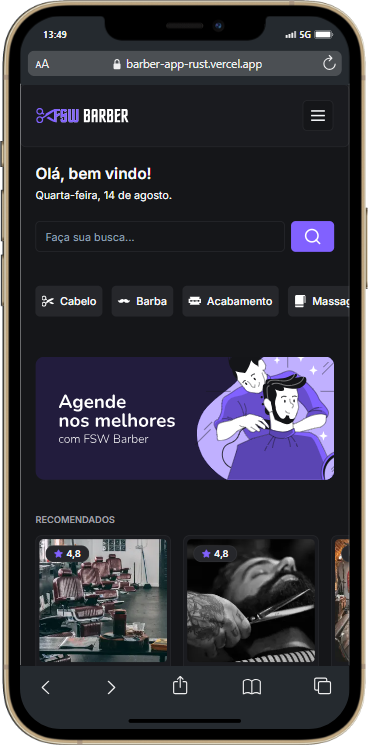

# Barber App

App de reserva de barbearia para clientes.  
[Veja o projeto](https://barber-app-rust.vercel.app/)

## Funcionalidades

- Campo de busca (serviços e barbearias)
- Login com conta do Google
- Reservar horário de atendimento
- Cancelar reserva de horário

## Tecnologias usadas

- Next JS
- TailwindCSS
- TypeScript
- Prisma
- PostgreSQL

## Referência

 - Projeto feito na FullStack Week de [Felipe Rocha](https://www.instagram.com/byfeliperocha/)

## Melhorias futuras

Para complementar o projeto, pode-se adicionar novas funcionalidades, como:
- Dashboard do administrador
- Cadastro de barbeiros
- Personalização de horários de atendimento
- Sistema de avaliação de barbearias
- Sistema de pagamento
- Sistema de lembrete por WhatsApp

## Autor

- [@hiigorsilva](https://github.com/hiigorsilva)

